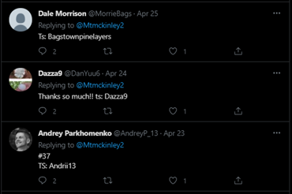
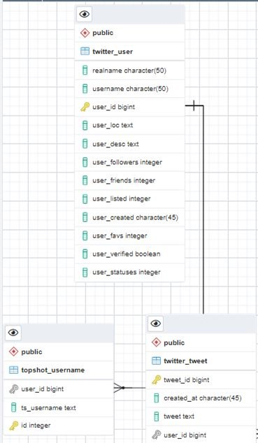

# Welcome to Twitter-topshotusername-extractor

# Written By: Max Paul
### Editor/ Mentor: Kevin Mentzer PhD.


```This tool was inspired and created from the work of an internet friend. Thank you for showing me what you do.```


```This tool is intended to store twitter data regarding topshot giveaways to a PostgreSQL database. After the data is stored from Streamer.ipynb, the user can then use final_push.ipynb to clean down the tweets; leabing behind only a topshot username```

``` Some potential use cases for this project would be to ID twitter users who tweet out non-distinct TS usernames. (which means a single person has more than one topshot account) *** in some not all cases ***```

```Another interesting use case could be personalized marketing campaigns through twitter. This database will allow us to connect a real twitter user to the Data Base created by Beau Gunderson ( the foriegn key being the topshot username ). We could leverage users past sales to show them up and coming events and or moments they may be interested in.```


***The NBATopShot community is a unique and special community; in the sense that it was one of the first successful projects that brought blockchain into the mind of someone who still thought of blockchain as something of the future. TopShot brings the excitement of blockchain into the industry of sports and sports collectibles.***


***Something notable was the involvement NBATopShot has with their community over twitter and how moments could be recommended by tagging “#NBATopShotThis”. In March of 2021 there was a pattern of twitter accounts doing moment giveaways. For example, a user would reply to the giveaway tagging three(3) friends and their TopShot username in the reply (Below)*** 

 <br>


***Additionally, after collecting 100,000 tweets there was an overwhelming syntax that arose, “TS:” or “TS-” followed by the username. After storing the data into a PostgreSQL database and doing data exploration, it was notable to find some twitter accounts that would use different TopShot usernames for giveaways. Along with identifying a person with multiple TopShot accounts, we can retrieve twitter data on the user (real name, location etc.). In doing so this would allow us to map a real person’s information to their TopShot username and their flow address from the TopShot PostgreSQL database.***


# Requirements

- python
	- psycopg2
	- pandas
	- re
	- sqlalchemy
- Postgre local database
	- ability to run pre-made SQL scripts to create the database
	- understand basic queries to extract info needed

# Files

This project contains a few different files, and here is what they do.


# tables.sql

- create a database in pgadmin with the name of your choosing
- enter the query tool and execute the `CREATE TABLE` commands in order
	- twitter_user
	- twitter_tweet
	- topshot_username
### Below is the ERD for this database
	- each user can tweet many times
	- each user can tweet more than one topshot names
	- would results in people with duplicate accounts (bad!!!)



# query.sql

- storage place for frequently used queries
	- has the query to get all tweets from the database containing "TS" minus n days from today
		- you can select how many days behind if you forget to run the final_push.ipynb one day
		- which is used in the final code


# Streamer.ipynb


### THIS FILE STARTS THE TWITTER LISTENER TO YOUR DATABASE
- Things to do before running
	- insert your Twitter Developer keys (bottom of file)
	- insert your postgre connection information
		- host
		- database
		- port 
		- user 
		- password
	- After these items are placed and your postgre tables are made you are ready to collect tweets.


# final_push.ipynb

## BE SURE TO EDIT QUERY IN FINAL PUSH BASED ON YOUR PUSHING SCHEDULE

` CURRENT_DATE - 1` is the equivalent to yesterday

 - edit query in code cell 2
   - takes tweets with topshot
   - also filters on date so you dont put the same exact data in twice
   - if we made user_id primary key we would not be able to ID users using multiple accounts

- Things to do before running
	-  insert your postgre connection information
		- host 
		- database
		- port 
		- user
		- password
	- at the end of the file make sure you connect SQLalchemy to your database so you can write the new data into their all at once instead of looping over each item.
	- After these items are placed you are ready to insert the cleaned data
